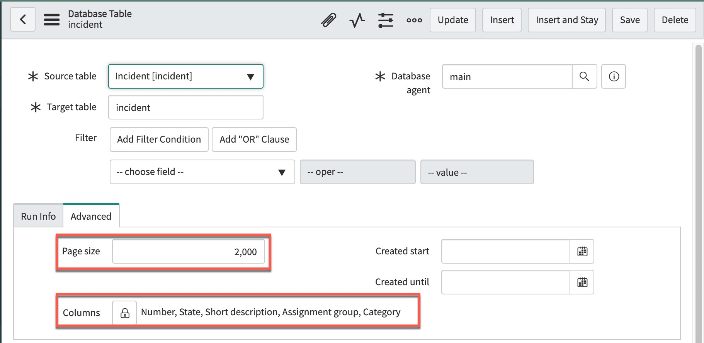

**SNDML** is a Java application which exports ServiceNow data to
Oracle, Microsoft SQL Server, MySQL or PostgreSQL.
**SNDML** is run on a Linux or Windows server.

**DataPump** is a scoped ServiceNow app which is installed in the ServiceNow instance
and is used to configure and manage SNDML jobs.

**SNDML** and **DataPump** are contributed software which can be downloaded from GitHub.
This page contains instructions for installing and configuring **DataPump** and **SNDML 3.5**.

## Contents
* [Downloading](#downloading)
* [Create Users and Grant Roles](#create-users-and-grant-roles)
* [Create a Connection Profile](#create-a-connection-profile)
* [Test Connectivity](#test-connectivity)
* [Create a Database Agent Record](#create-a-database-agent-record)
* [Configure a Table and a Job](#configure-a-table-and-a-job)
* [Run an SNDML Scan](#run-an-sndml-scan)
* [Methods for Running Jobs](#methods-for-running-jobs)
* [Creating Schedules](#creating-schedules)
* [Synchronized Scanning](#synchronized-scanning)
* [Run SNDML as a Daemon](#run-sndml-as-a-daemon)
* [Run Jobs via a MID Server](#run-jobs-via-a-mid-server)
* [Job Action Types](#job-action-types)
* [Optimizing Exports](#optimizing-exports)
* [Feedback and Support](#feedback-and-support)

## Downloading

JAR files for **SNDML** and the installation Update Set for **DataPump** can be downloaded from
* [https://github.com/gflewis/sndml3/releases](https://github.com/gflewis/sndml3/releases)

When you unpack the ZIP file (**sndml-3.5.x.x.zip**) you should find these files:
* **DataPump-v3.5.x.x-Install.xml** - _Update Set to install or upgrade the ServiceNow app_
* **sndml-3.5.x.x-mssql.jar** - _JAR file for use with Microsoft SQL Server_
* **sndml-3.5.x.x-mysql.jar** - _JAR file for use with MySQL_
* **sndml-3.5.x.x-ora.jar** - _JAR file for use with Oracle_
* **sndml-3.5.x.x-pg.jar** - _JAR file for use with PostgreSQL_

The **Update Set** should be installed in your ServiceNow instance.
If you have installed an earlier version of **DataPump**
(including v1.1 from the ServiceNow Share site)
then you should be able to use the **Install.xml**
Update Set to upgrade to the latest version.
Please test the upgrade using a non-production instance of ServiceNow.

The appropriate JAR file (based on your database)
should be copied to the Linux or Windows server that will be running the jobs.

## Create Users and Grant Roles

After installing the Update Set in your instance, 
the first step is to create two new ServiceNow service accounts 
which will be used by the Java agent.

### datapump.agent
This user will be used to retrieve configuration information from the DataPump scoped app 
and to update the status of running jobs.
* Set **Time zone** to **GMT**
* Set **Web service access only** to **true**
* Grant **x_108443_sndml.daemon** role
* Assign the user a secure password which will be entered in the **Connection Profile** below

### datapump.reader
This user will be used to export data from the instance.
It requires "read" access to any tables which will be exported.
* Set **Time zone** to **GMT**
* Set **Web service access only** to **true**
* Grant **snc_read_only** role
* Grant **soap_query** role
* Grant **itil** role and/or any roles necessary to read the requisite tables.
* Assign the user a secure password which will be entered in the **Connection Profile** below

Do not grant  **x_108443_sndml.admin** role to either of these service accounts.
Users with **x_108443_sndml.admin** role can configure and monitor DataPump jobs.

## Create a Connection Profile

The **Connection Profile** is a Java properties file that contains 
credentials for the database and the ServiceNow instance, 
as well as other parameters that affect processing. 
The name of the Connection Profile is passed to the Java program
using the `-p` or <code>&#8209;&#8209;profile</code>  command line option.
The Connection Profile looks like this:

```
database.url=jdbc:mysql://<database-host>/<dbname>
database.schema=<schemaname>
database.username=******
database.password=******

app.instance=dev000000
app.username=datapump.agent
app.password=******

app.agent=main

reader.instance=dev000000
reader.username=datapump.reader
reader.password=******
```

Since the **Connection Profile** contains passwords, 
it should be in a protected location on your Linux or Windows server
and secured using permissions or ACLs.

The format of `database.url` will vary based on whether you are using 
MySQL, PostgreSQL, Oracle or Microsoft SQL Server. 
Please refer to the documentation on configuring a JDBC URL based on the type of your database.

The values of `app.instance` and `reader.instance` can either be a full URL (starting with `https://`)
or an instance name.

The value of `app.agent` must match the name used in the **Database Agent** record below.

For more detail on the Connection Profile refer to
[Connection Profle 3.5](https://github.com/gflewis/sndml3/wiki/Connection-Profile-3.5)

## Test Connectivity

Before configuring the Agent, it is a good idea to run a quick connectivity test.
This will verify that the profile contain valid credentials,
and that the Java program can write to target database schema.

For this test, you should choose a table that has some data, but is not too large.
Good tables for this test might include 
`cmdb_ci_service` or `cmn_location`.

Using the appropriate JAR file, type the following command:

<!--
    java -ea -jar <jarfilename> -p <profilename> -t <tablename>
-->

<pre class="highlight">
java -ea -jar <var>jarfilename</var> -p <var>profilename</var> -t <var>tablename</var>
</pre>


The Java program should connect to ServiceNow and to the database,
create a new table in the target schema,
and copy the ServiceNow data into the newly created table.

If you run the command a second time, the the `CREATE TABLE` will be missing.
When SNDML starts a job, 
it first check to see if the target table exists in the schema.
If an existing table is not found
then SNDML will issue a `CREATE TABLE` statement
before starting the load.

If the initial test is successful, then we can begin configuring the Agent.

## Create a Database Agent Record

In your ServiceNow instance, go to **DataPump > Agents** and click **New**. 
Create a new Database Agent record with the name "main".

## Configure a Table and a Job

For the first test of the Agent, you should again choose a ServiceNow table 
which has a small number of records.

1. Go to **DataPump > Agents**.
2. Open the "main" agent configured above.
3. Click the **New** button above the **Tables** related list.
4. Select a **Source table**.
5. **Save** the record.
6. Click the **New** button above the **Jobs** related list.
7. For **Action type** select "Insert".
8. **Save** the record.
9. Click the **Execute Now** button.

For additonal information about configuring jobs
refer to [Job Action Types](#job-action-types) below.

Your newly created **Job Run** record has a status of **Ready**.
It is waiting to be executed by the Java Agent.

## Run an SNDML Scan

On your Linux or Windows server, type this command:

<!--
    java -ea -jar <jarfilename> -p <profilename> --scan
-->
    
<pre class="highlight">
java -ea -jar <var>jarfilename</var> -p <var>profilename</var> --scan
</pre>

The `--scan` command looks for any **Job Run** records that are **Ready**,
and executes them.

As the job executes, the **Job Run** record will be updated,
and rows will be appended to the **Job Run Logs** related list.
If you are viewing the **Job Run** record in ServiceNow, 
then you should see the counters and the status changing.

When each job completes, `--scan` checks for new **Job Run** records that are **Ready**.
If none are found then the Java program terminates.

## Methods for Running Jobs
Once a **Job Run** record is created with a state of "Ready", it must be be detected by the Java agent. 
There are four methods for this.
* [Synchronized Scanning](#synchronized-scanning) (`scan`)
* [Run SNDML as a Daemon](#run-sndml-as-a-daemon) (`--daemon`)
* [Run Jobs via a MID Server](#run-jobs-via-a-mid-server) (`--jobrun`)
* [Run SNDML as an HTTP Server](#run-sndml-as-an-http-server) (`--server`)

With the first two methods (<code>&#8209;&#8209;scan</code> and <code>&#8209;&#8209;daemon</code>) 
there will be a small delay 
between when the **Job Run** record is marked "Ready" and when execution starts.
The second two methods (<code>&#8209;&#8209;jobrun</code> and <code>&#8209;&#8209;server</code>) 
are new in Release 3.5 and eliminate this delay.
The second two methods and are configured using the **Job Run Autostart** field on the **Agent** record.

## Creating Schedules
DataPump jobs can be grouped together in **Schedules**, and 
automatically activated by the ServiceNow scheduler. 
The steps are as follows:

1. Create a Schedule by going to **DataPump > Schedules**, and clicking New.
2. Create **Jobs** by going to **DataPump > Tables**, opening a table, 
   and clicking the **New** button above the Jobs related list.
3. The **Job** must be saved before it can be added to a Schedule. 
   To add a **Job** to a **Schedule**, edit the **Schedule** field on the **Job** form.
4. To test a Schedule, open the **Schedule** form and click the **Execute Now** button.

Since the DataPump table `x_108443_sndml_action_schedule` is extended from the 
out-of-box table **Scheduled Script Execution**,
Schedules can be configured to run at any frequency permitted by ServiceNow.

If a **Job** is part of a **Schedule**, then the **Order** field on the **Job** form becomes important. 
Jobs within a Schedule are processed in order, based on the **Order** field. 
If multiple Jobs have the same **Order** value, then they may run concurrently, 
subject to the number of available threads. 
(The number of threads is configured in the Connection Profile.) 
Jobs with a higher **Order** value will remain in a **Scheduled** state 
until all Jobs with a lower **Order** value complete. 

This screenshot shows a schedule with three jobs. 
The table **sys_user_grmember** will be exported after the other two jobs complete.


All Jobs within a Schedule will have the same "start time", regardless of when they actually start running. 
The Java agent will only export records that were inserted before the "start time". 
"Start time" is based on when the **Job Run** record was created, 
not when the **Status** was changed to "Running". 
All **Job Run** records in a **Schedule Run** are created at the same time, 
therefore the application will not export records inserted after the start of another job in the same schedule.

## Synchronized Scanning

Synchronized Scanning involves using **cron** or **Windows Task Scheduler** to run a `--scan`. 
The start time of the Linux or Windows job is synchronized with the start time of the ServiceNow schedule. 
The Linux or Windows job should start a few minutes after the ServiceNow schedule.
For example, if the ServiceNow schedule starts at 5:00 PM,
then you might set your Linux or Windows `--scan` to start at 5:02 PM.

The SNDML JAR file contains an embedded Log4J2 Rolling File Appender configuration 
which can be helpful if you are using **cron** or **Windows Task Scheduler**. 
The name of this configuration file is **log4j2-daemon.xml**, 
and it requires two system properties:

* `sndml.logFolder` - the directory where log files are written
* `sndml.logPrefix` - a prefix which will be prepended to the log file name

Use this command to run the Java agent redirecting all output to the log directory:

<pre class="highlight">
java -Dlog4j2.configurationFile=log4j2-daemon.xml \
  ‑Dsndml.logFolder=<var>log-directory</var> ‑Dsndml.logPrefix=<var>agent-name</var> \
  -jar <var>jar-file</var> -p <var>connection-profile</var> --scan
</pre>


Note that a `-D` prefix is used when passing system properties to Java, 
and that system properties are case sensitive.

<!--
Here is an example of a Linux `crontab` entry that runs the Java agent 4 times per hour
(at 2, 17, 32 and 47 minutes past the top of the hour):

```
02,17,32,47 * * * * java -Dlog4j2.configurationFile=log4j2-daemon.xml -Dsndml.logFolder=<log_directory> ‑Dsndml.logPrefix=datapump-cron -jar <jar_file> -p <connection_profile> --scan >/dev/null 2>&1
```
-->

## Run SNDML as a Daemon

The `--daemon` option is the simplest to configure. 
This option simply runs SNDML  in an endless loop, 
performing a `--scan` every 2 minutes.

The frequency of scans can be changed 
by setting the value of the **Connection Profile** property `daemon.interval`
to the number of seconds between scans.

Use this command to start the daemon as a background process on Linux:

<pre class="highlight">
java -Dlog4j2.configurationFile=log4j2-daemon.xml \
  ‑Dsndml.logFolder=<var>log-directory</var> ‑Dsndml.logPrefix=<var>agent-name</var> \
  -jar <var>jar-file</var> -p <var>connection-profile</var> --daemon >/dev/null 2>&1
</pre>

If the **Connection Profile** contains a property named `daemon.pidfile`
then at startup the Java program will write its PID to this file.
You can then terminate the daemon by sending a SIGTERM signal to the PID.

## Run Jobs via a MID Server

The `--jobrun` option causes the Java program to execute a single **Job Run**, and then terminate.
The `sys_id` of the **Job Run** record is passed as a command line argument.
This option is used for executing jobs through the MID Server.

To configure this option you must set **Job Run Autostart** on the **Agent** form to **MID Server**
and select an appropriate **MID Server Script File**.

When the **DataPump** app is installed, 
it will create two MID Server Script files, one named `jobrun.ps1` and one named `jobrun.sh`.
These scripts assume that the JAR file has been installed 
and that SNDML will be running locally on the MID Server.
However, it also expected that the script will need to be customized
based on how your MID Server is configured.

When using this option, care must be taken to not run too many jobs concurrently,
as this could exhaust the memory on the MID Server.
Since each job runs as a separate process on the server,
SNDML cannot constrain the number of concurrent jobs.

## Run SNDML as an HTTP Server

The `--server` option runs the Java program as an HTTP server.
When the state of a **Job Run** changes to **Ready**
an HTTP message is sent to the SNDML server.
The HTTP message only contains the `sys_id` of the **Agent** 
and the `sys_id` of the **Job Run** record.
SNDML uses its ServiceNow HTTPS connection (REST API) to retrieve the **Job Run** information,
and it starts execution of the job.


To configure this option add the following to [Connection Profile](#create-a-connection-profile):

* `server.port=5124`
* `server.pidfile=pidfile.pid`

Configure the *Agent* as follows:

* Set **Job Run Autostart** to **HTTP Server**
* Set **HTTP Server Host** to the IP address of the Linux or Windows server
* Set **HTTP Port** to **5124**

In addition, you must modify your firewall configuration to open TCP/IP port 5124 for inbound connections.

(Note that you can choose a different TCP/IP port as long as the **Connection Profile**
and the **Agent** are configured consistently.)

As an alternative to opening the TCP/IP port for inbound connnections, 
you can install a MID Server on the same box as SNDML.
In this case you will specify **MID Server** on the **Agent** configuration form.
Since the MID Server will be forwarding TCP/IP messages 
to an SNDML server on the same box,
you should specify the **HTTP Server Host** as `localhost`.

Use this command to start the HTTP server as a background process on Linux:

<pre class="highlight">
java -Dlog4j2.configurationFile=log4j2-server.xml \
  ‑Dsndml.logFolder=<var>log-directory</var> ‑Dsndml.logPrefix=<var>agent-name</var> \
  -jar <var>jar-file</var> -p <var>connection-profile</var> --server >/dev/null 2>&1
</pre>

To shut down the HTTP server, send a SIGTERM signal to the PID which was written to the pidfile
when SNDML started.

## Job Action Types

### Insert
**Insert** is used for initial loading or reloading of SQL tables. 
It inserts rows into the target table. 
If a record with the same sys_id already exists in the target table, 
then a primary key violation will occur and the row will be skipped.

If **Truncate** is checked, then the SQL table will be truncated prior to the load.

### Upsert
**Upsert** is used to load or update SQL tables. 
If the target record exists (based on `sys_id`), then it will be updated. 
Otherwise, it will be inserted.

<!--
<blockquote><code>sys_updated_on>=</code><i><b><small>lastrunstart</small></b></i></blockquote>
where 
<i><b><small>lastrunstart</small></b></i>
-->

If **Since Last** is checked, then only records inserted or updated in ServiceNow since the last run 
will be processed. The following filter will be used when retrieving records from ServiceNow:

<pre>
sys_updated_on&gt;=<var>lastrunstart</var>
</pre>

where <var>lastrunstart</var>
is determined from the **Last Run Start** field on the Database Table record.

### Sync
**Sync** compares the timestamps (`sys_updated_on`) in the source and target tables. 
Based on this comparison it will insert, update or delete target records. 
If the values of `sys_updated_on` match, then the record will be skipped.

If a **Filter** has been configured for the Database Table, 
the **Sync** will delete any records which do not match the filter.

### Execute
**Execute** executes an arbitrary SQL statement. 
This is typically used to run a database stored procedure.

## Optimizing Exports

The DataPump Java agent uses the REST Table API to retrieve data from ServiceNow. 
Records are retrieved in chunks referred to as "pages". 
By default, the agent will retrieve all fields in the ServiceNow record, and use a page size of 200, 
meaning that it will retrieve and process 200 records at a time. 
(The default page size can changed in the connection profile.) The processing sequence is as follows:

1. Fetch 200 records (_i.e._ one page) from ServiceNow
2. Insert or Update the SQL table
3. Commit the changes to the SQL database
4. Update the record counters in the DataPump Job Run table 
5. Repeat

In general, most of the time is spent communicating with ServiceNow. 
Interactions with the SQL database are relatively quick.

The primary two techniques to improve the performance of exports are to reduce the number of columns 
and to increase the page size. 
In this example, we have have selected 5 columns from the Incident table and increased the page size to 2000.



The fields `sys_id`, `sys_created_on` and `sys_updated_on` are always exported by the Java agent, 
regardless of whether or not they are included in the column list; 
so in this example we are actually exporting 8 columns.

By making these two changes, the export time for 100,000 Incident records was reduced 
rom 12 minutes to 3 minutes in an AWS benchmark test with a PDI. Your results may vary.

It is important to note that DataPump will NOT add or drop columns in a pre-existing table. 
If you change the Columns setting on the Database Table form after the SQL table has been created, 
then you must either use ALTER TABLE to modify the table structure, 
or drop the table and allow DataPump to recreate it.

## Feedback and Support

If you have questions or issues with SNDML or the DataPump app,
please use the [SNDML Github Issues Page](https://github.com/gflewis/sndml3/issues)
to open a new issue.
