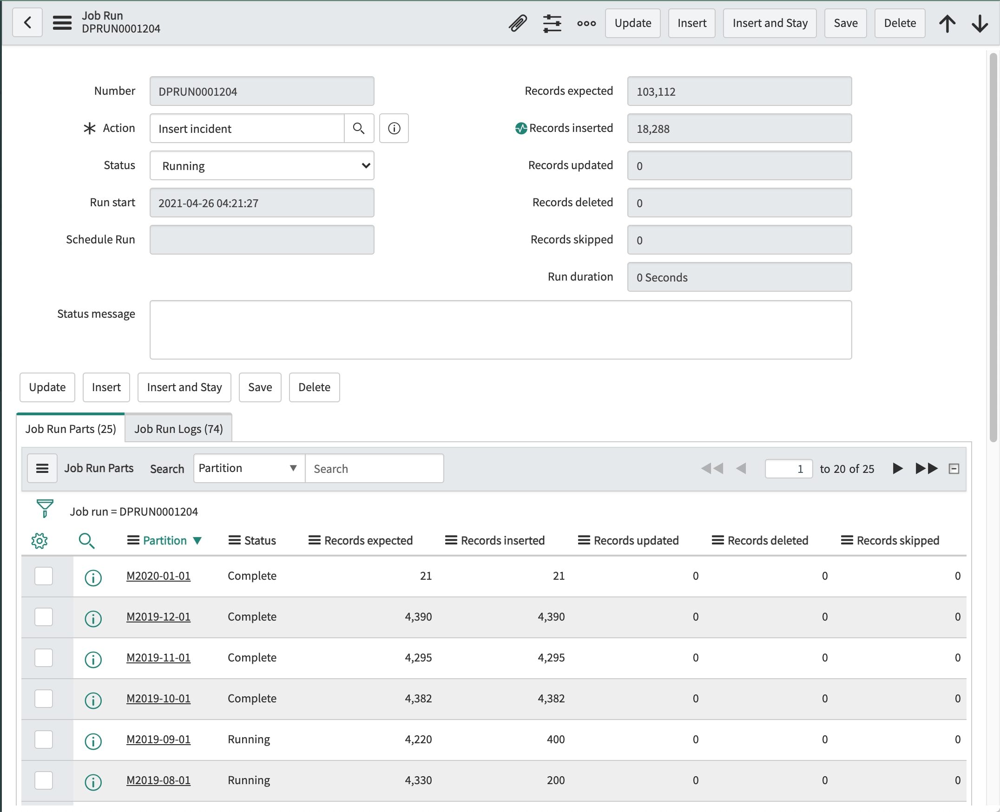

## Server Location
For optimal throughput, a high performance connection to ServiceNow is required. 
This will generally be available if the server used for the DataPump Java agent is in a data center 
or a commercial cloud; but will not normally be available is the agent is run from a personal workstation.

It is also important that the Java agent run in the same subnet as the target database.
If the SQL database is in a data center, then the Java agent should run on a server in the same data center. 
If the SQL database is in an AWS or Azure cloud, 
then the Java agent should run on a server in the same region.

The Java agent performs a lot of IO, but very little computation; 
so a minimally configured virtual machine is generally adequate.

## DataPump Paging
The DataPump Java agent uses the REST Table API to retrieve data from ServiceNow. 
Records are retrieved in chunks referred to as "pages". 
By default, the agent will retrieve all fields in the ServiceNow record, 
and use a page size of 200, meaning that it will retrieve and process 200 records at a time. 
(The default page size can changed in the connection profile.) 
The processing sequence is as follows:

1. Fetch 200 records (i.e. one page) from ServiceNow
2. Insert or Update the SQL table
3. Commit the changes to the SQL database
4. Update the record counters in the DataPump **Job Run** table 
5. Repeat

In general, most of the time is spent communicating with ServiceNow. 
Interactions with the SQL database are relatively quick.

The primary two techniques to improve the performance of exports are to reduce the number of columns 
and to increase the page size. 
In this example, we have have selected 5 columns from the Incident table and increased the page size to 2000.

The fields `sys_id`, `sys_created_on` and `sys_updated_on` are always exported by the Java agent, 
regardless of whether or not they are included in the column list; 
so in this example we are actually exporting 8 columns.

By making these two changes, the export time for 100,000 Incident records was reduced 
from 12 minutes to 3 minutes in an AWS benchmark test with a PDI. Your results may vary.

It is important to note that DataPump will **NOT** add or drop columns in a pre-existing table. 
If you change the **Columns** setting on the Database Table form after the SQL table has been created, 
then you must either use ALTER TABLE to modify the table structure, 
or drop the table and allow DataPump to recreate it.

## Partitioned Exports

Task based tables may contain a large amount of history, and may take a many hours to initially export. The application allows these tables to be exported in sections (i.e. partitions), based on the record creation date (sys_created_on).

**Partition** may be specified on the Job form as **Quarter**, **Month**, **Week** or **Day**. 
When performing a partitioned export, the Java agent starts by determining the 
minimum and maximum values of `sys_created_on`, and then divides the work accordingly. 
All partitions are written to the same target table.

Partitions are exported in reverse chronological order. 
In other words, the most recent partition is always exported first. 
In some cases this may permit useful analysis of recent data while the export of older data continues.

If a **Partition** is specified for a **Job**, then a **Job Run Parts** tab 
will appear at the bottom of the **Job Run** form.

If **Partition** is specified for a **Job**, then **Threads** may also be specified. 
If the number of threads is 2 or more, then the Java agent will export multiple partitions in parallel. 
In some situations the total export time for large tables may be reduced by using multiple threads.

**Caution:** The use of multiple threads may adversely impact the performance of your ServiceNow instance.

