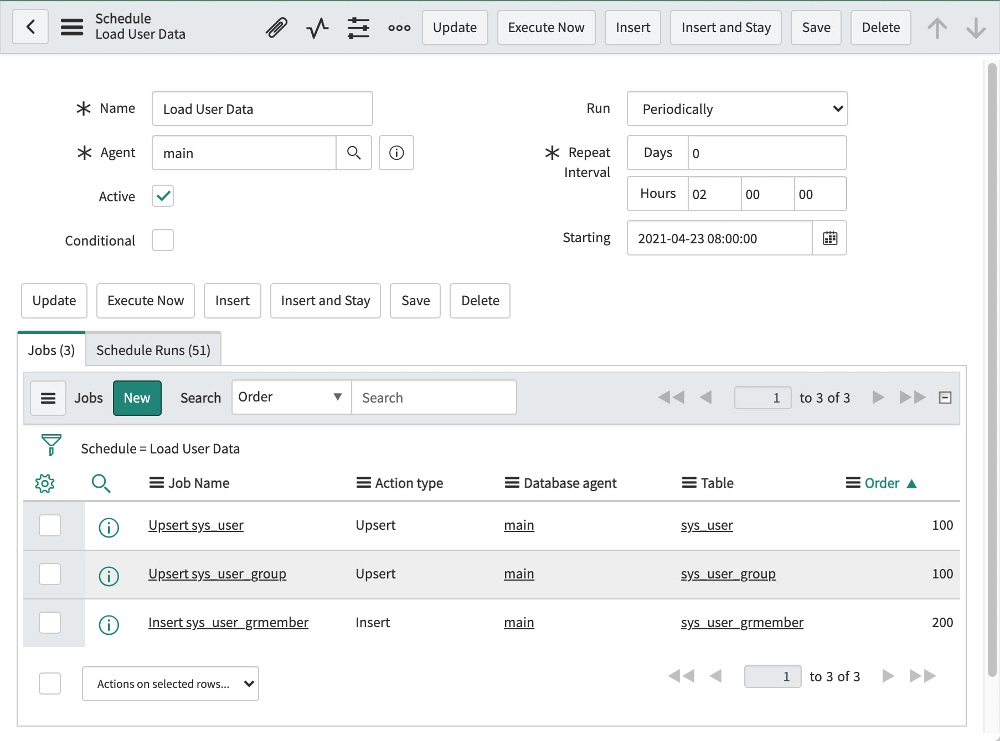

## Creating Schedules
DataPump jobs can be grouped together in **Schedules**, and 
automatically activated by the ServiceNow scheduler. 
The steps are as follows:

1. Create a Schedule by going to **DataPump > Schedules**, and clicking New.
2. Create **Jobs** by going to **DataPump > Tables**, opening a table, 
   and clicking the **New** button above the Jobs related list.
3. The **Job** must be saved before it can be added to a Schedule. 
   To add a **Job** to a **Schedule**, edit the **Schedule** field on the **Job** form.
4. To test a Schedule, open the Schedule form and click the **Execute Now** button.

Since the DataPump table `x_108443_sndml_action_schedule` is extended from the 
out-of-box table **Scheduled Script Execution**,
Schedules can be configured to run at any frequency permitted by ServiceNow.

If a **Job** is part of a **Schedule**, then the **Order** field on the Job form becomes important. 
Jobs within a Schedule are processed in order, based on the Order field. 
If multiple Jobs have the same Order number, then they may run concurrently, 
subject to the number of available threads. 
(The number of threads is configured in the connection profile.) 
Jobs with a higher order number will remain in a "Scheduled" state until Jobs with a lower Order number complete. 

This screenshot shows a schedule with three jobs. 
The table **sys_user_grmember** will be exported after the other two jobs complete.

All Jobs within a Schedule will have the same "start time", regardless of when they actually start running. 
The Java agent will only export records that were inserted before the "start time". 
"Start time" is based on when the **Job Run** record was created, 
not when the **Status** was changed to "Running". 
All **Job Run** records in a **Schedule Run** are created at the same time, 
therefore the application will not export records inserted after the start of another job in the same schedule.

## Running Scheduled Jobs
Once a Job Run record is created with a state of "Ready", it must be be detected by the Java agent. 
There are several techniques for managing this. 